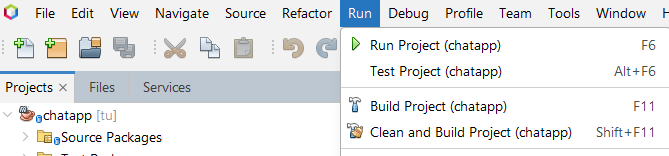

# CT240-CHAT-APP

## 🤔Mục đích

Xây dựng ứng dụng Chat App cung cấp môi trường cho người dùng có thể nhắn tin, trao đổi thông tin với các người dùng đang online khác. Người dùng cần đăng ký tài khoản và đăng nhập để sử dụng ứng dụng

## 👍Chức năng cơ bản

### Phía Server:

- **Chạy máy chủ**: Xử lý các yêu cầu từ người dùng như đăng nhập, đổi ảnh đại diện, nhắn tin...
- **Dừng máy chủ**: Tạm ngừng hoạt động của máy chủ để bảo trì, sửa chữa hoặc nâng cấp phần mềm

### Phía Client:

- **Đăng ký**: Người dùng có thể tạo tài khoản khi sử dụng ứng dụng
- **Đăng nhập**: Người dùng có tài khoản để đăng nhập sử dụng các chức năng của ứng dụng
- **Đăng xuất**: Người dùng có thể đăng xuất khỏi hệ thống
- **Chọn người dùng để nhắn tin**: Tìm kiếm vào chọn người dùng từ danh sách online để nhắn tin
- **Nhắn tin**: Gửi tin nhắn cho người dùng đã chọn từ danh sách online
- **Đổi mật khẩu tài khoản**: Thay đổi mật khẩu khi cần thiết
- **Đổi ảnh đại diện**: Thay đổi ảnh đại diện theo sở thích cá nhân
- **Gửi file**: Gửi file cho người dùng khác
- **Gửi emoji**: Gửi các emoji cho người dùng khác để bày tỏ một cảm xúc nào đó

## 🖥️Giao diện người dùng

#### Máy chủ

#### Đăng nhập

#### Giao diện chính

#### Đổi mật khẩu

#### Đổi ảnh đại diện

#### Chọn người dùng để chat

#### Gửi file

#### Gửi emoji

### DEMO

## 🔧Cài đặt dự án

**Maven**

1. Download dự án về máy bằng link liên kết này:[Chat App](https://github.com/tu1511/CT240-ChatApp)
2. IDE: đề xuất Netbeans (mới nhất)
3. Cài đặt JDK 20 và apache maven (>= 3.x)
4. Cài đặt MySql workbench và tạo cơ sở dữ liệu có tên là **chatapp**
5. Click chọn tool có sẵn trên netbeans để clean và build dự án: 

## 📺Công nghệ sử dụng

- **Frontend**
  Java swing
- **Backend**
  Java
- **Database**
  MySql workbench
- **Kiến trúc**
  Mô hình MVC

# CT240 - 2024
